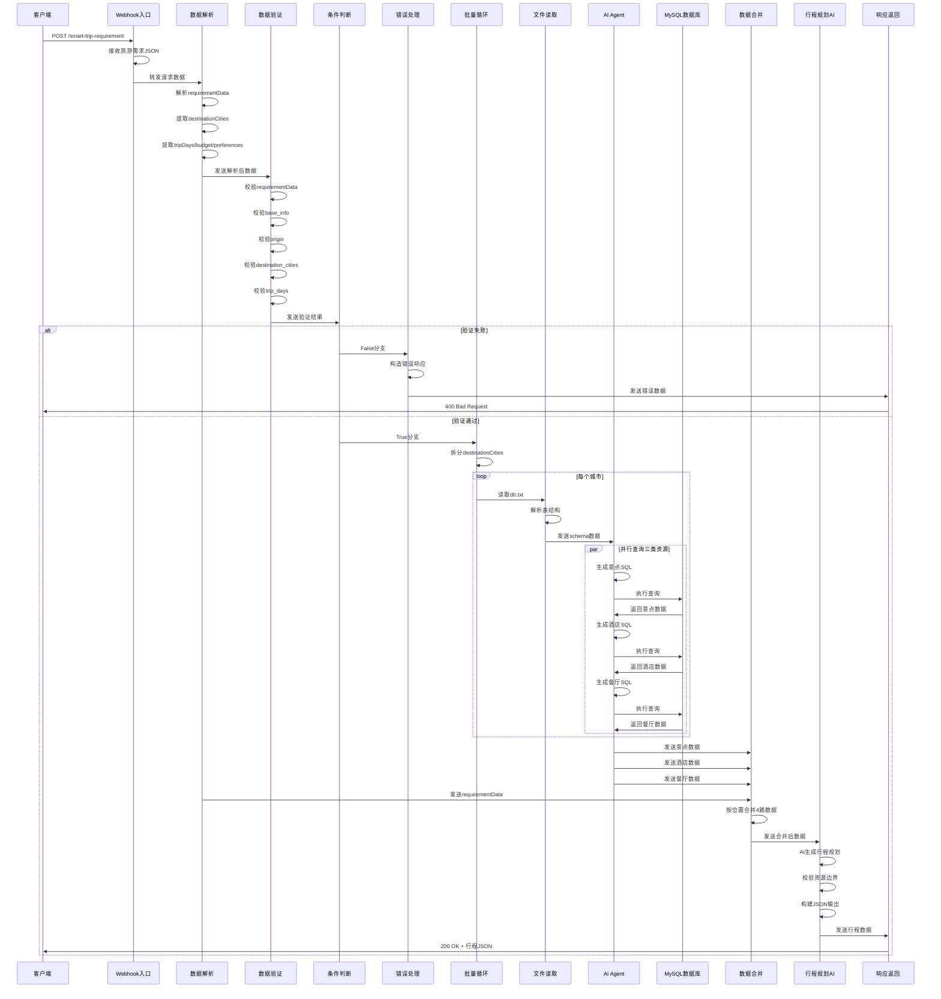

# 旅游行程规划AI Workflow 技术文档

## 目录

1. [工作流概述](#1-工作流概述)
2. [前置依赖与环境要求](#2-前置依赖与环境要求)
3. [架构设计](#3-架构设计)
4. [节点配置详情](#4-节点配置详情)
5. [数据流转逻辑](#5-数据流转逻辑)
6. [异常处理机制](#6-异常处理机制)
7. [执行流程时序图](#7-执行流程时序图)
8. [关键功能实现说明](#8-关键功能实现说明)
9. [使用注意事项](#9-使用注意事项)
10. [API接口规范](#10-api接口规范)

---

## 1. 工作流概述

### 1.1 功能简介

本Workflow是一个基于n8n构建的智能旅游行程规划系统，通过集成DeepSeek AI大模型能力，实现从用户需求输入到完整行程规划生成的全自动化流程。系统能够根据用户提供的旅游目的地、天数、预算、偏好等信息，自动查询数据库中的景点、酒店、餐厅资源，并利用AI生成精确到小时的每日行程规划。

### 1.2 核心能力

- **智能数据验证**：对用户输入的旅游需求进行多维度校验
- **多源数据聚合**：并行查询景点、酒店、餐厅三类资源数据
- **AI驱动规划**：基于DeepSeek模型生成结构化行程方案
- **安全SQL生成**：通过AI Agent自动生成安全的MySQL查询语句
- **零幻觉约束**：严格限制AI仅从提供的候选资源中选择

### 1.3 工作流元数据

| 属性 | 值 |
|------|-----|
| 工作流名称 | My workflow |
| 工作流ID | q5c6Cs9AZQs7WM9i |
| 版本ID | a8db6169-3fae-49f6-aac1-ac83df9c193f |
| 执行顺序 | v1 |
| 状态 | Active |

---

## 2. 前置依赖与环境要求

### 2.1 系统依赖

| 依赖项 | 版本要求 | 说明 |
|--------|----------|------|
| n8n | 1.x+ | 工作流引擎 |
| MySQL | 8.0+ | 数据存储 |
| DeepSeek API | - | AI模型服务 |

### 2.2 凭证配置

工作流使用以下凭证配置：

#### 2.2.1 MySQL数据库凭证
```json
{
  "credentialType": "mySql",
  "id": "FkzLGAfMbt4lMWox",
  "name": "MySQL account"
}
```

#### 2.2.2 DeepSeek API凭证
```json
{
  "credentialType": "deepSeekApi",
  "id": "y9k74SOp5QfbKpgt",
  "name": "DeepSeek account"
}
```

### 2.3 文件依赖

| 文件路径 | 用途 |
|----------|------|
| `/home/node/.n8n-files/db.txt` | 数据库表结构定义文件 |

### 2.4 数据库表结构要求

工作流依赖以下数据库表：

- `attractions` - 景点信息表
- `hotels` - 酒店信息表
- `restaurants` - 餐厅信息表

---

## 3. 架构设计

### 3.1 整体架构图

```
┌─────────────────────────────────────────────────────────────────────────────┐
│                           旅游行程规划AI Workflow                            │
├─────────────────────────────────────────────────────────────────────────────┤
│                                                                             │
│  ┌──────────────┐     ┌──────────────┐     ┌──────────────────────────┐    │
│  │   Webhook    │────▶│  数据解析    │────▶│      数据验证模块        │    │
│  │   入口节点   │     │  与校验      │     │  (校验旅游需求必要数据)   │    │
│  └──────────────┘     └──────────────┘     └──────────────────────────┘    │
│                                                       │                     │
│                              ┌────────────────────────┘                     │
│                              ▼                                              │
│                    ┌──────────────────┐                                     │
│                    │   条件判断分支    │                                     │
│                    │ (检查数据校验结果)│                                     │
│                    └────────┬─────────┘                                     │
│                             │                                               │
│            ┌────────────────┼────────────────┐                              │
│            ▼                ▼                ▼                              │
│    ┌──────────────┐ ┌──────────────┐ ┌──────────────────┐                  │
│    │   错误处理    │ │  数据循环处理 │ │   资源查询分支    │                  │
│    │   与返回      │ │ (循环目的地城市)│ │                  │                  │
│    └──────────────┘ └──────┬───────┘ │  ┌────────────┐  │                  │
│                            │         ├──▶│ 景点查询   │  │                  │
│                            │         │  │ (AI+MySQL) │  │                  │
│                            │         │  └────────────┘  │                  │
│                            │         │  ┌────────────┐  │                  │
│                            │         ├──▶│ 酒店查询   │  │                  │
│                            │         │  │ (AI+MySQL) │  │                  │
│                            │         │  └────────────┘  │                  │
│                            │         │  ┌────────────┐  │                  │
│                            │         └──▶│ 餐厅查询   │  │                  │
│                            │            │ (AI+MySQL) │  │                  │
│                            │            └────────────┘  │                  │
│                            │                            └──────────────────┘
│                            ▼                                               │
│                   ┌──────────────────┐                                     │
│                   │   数据合并节点    │                                     │
│                   │     (Merge)      │                                     │
│                   └────────┬─────────┘                                     │
│                            ▼                                               │
│                   ┌──────────────────┐                                     │
│                   │  AI行程规划节点   │                                     │
│                   │  (旅游行程规划)   │                                     │
│                   └────────┬─────────┘                                     │
│                            ▼                                               │
│                   ┌──────────────────┐                                     │
│                   │   响应返回节点    │                                     │
│                   │  (数据返回成功)   │                                     │
│                   └──────────────────┘                                     │
│                                                                             │
└─────────────────────────────────────────────────────────────────────────────┘
```

### 3.2 节点类型分布

| 节点类型 | 数量 | 用途 |
|----------|------|------|
| Webhook | 2 | 请求接收与响应 |
| Set | 3 | 数据解析与设置 |
| Code | 4 | 数据验证与转换 |
| If | 1 | 条件判断 |
| SplitInBatches | 1 | 批量循环处理 |
| ReadWriteFile | 1 | 文件读取 |
| ExtractFromFile | 1 | 文件内容提取 |
| MySQL | 3 | 数据库查询 |
| Merge | 1 | 数据合并 |
| Agent (LangChain) | 4 | AI智能体 |
| LM Chat (DeepSeek) | 4 | AI语言模型 |
| Output Parser | 4 | 结构化输出解析 |

---

## 4. 节点配置详情

### 4.1 触发与输入节点

#### 4.1.1 获取旅游需求详细数据 (Webhook)

| 属性 | 配置值 |
|------|--------|
| 节点ID | 2fcb6983-1f2d-4742-8bd2-f4333fcad81c |
| 节点类型 | n8n-nodes-base.webhook |
| 版本 | 2 |
| HTTP方法 | POST |
| 路径 | smart-trip-requirement |
| 响应模式 | responseNode |
| Webhook ID | 81cea40d-1af6-4519-8aaa-08aac4ecede4 |

**功能说明**：接收外部系统发送的旅游需求数据，作为工作流的入口点。

---

### 4.2 数据解析节点

#### 4.2.1 解析旅游需求数据1 (Set)

| 属性 | 配置值 |
|------|--------|
| 节点ID | b0d6ac34-11c3-4865-b18d-533e2456b2f4 |
| 节点类型 | n8n-nodes-base.set |
| 版本 | 3.4 |

**字段映射**：

| 字段名 | 类型 | 表达式 |
|--------|------|--------|
| destinationCities | array | `{{ $json.body.requirement_json_data.base_info.destination_cities }}` |

#### 4.2.2 解析旅游需求数据2 (Set)

| 属性 | 配置值 |
|------|--------|
| 节点ID | 3cda25ff-c200-4471-b6fe-cc88f0d8113b |
| 节点类型 | n8n-nodes-base.set |
| 版本 | 3.4 |

**字段映射**：

| 字段名 | 类型 | 表达式 | 说明 |
|--------|------|--------|------|
| requirementData | object | `{{ $json.body }}` | 完整需求数据 |
| destinationCities | array | `{{ $json.body.requirement_json_data.base_info.destination_cities }}` | 目的地城市列表 |
| tripDays | number | `{{ $json.body.requirement_json_data.base_info.trip_days }}` | 行程天数 |
| budget | object | `{{ $json.body.budget \|\| {} }}` | 预算信息 |
| preferences | object | `{{ $json.body.preferences \|\| {} }}` | 偏好设置 |

---

### 4.3 数据验证节点

#### 4.3.1 校验旅游需求必要数据 (Code)

| 属性 | 配置值 |
|------|--------|
| 节点ID | f2d0bb7d-8875-4e89-8f41-29de74b2efe0 |
| 节点类型 | n8n-nodes-base.code |
| 版本 | 2 |

**验证逻辑**：

```javascript
const items = $input.all();

return items.map(item => {
  const data = item.json;
  const validationResult = {
    isValid: true,
    errors: [],
    warnings: []
  };

  const addError = (message) => {
    validationResult.isValid = false;
    validationResult.errors.push(message);
  };

  // 结构校验
  const baseInfo = data.requirementData.requirement_json_data.base_info;

  if (!data.requirementData) {
    addError('requirementData is missing');
  } else if (!baseInfo) {
    addError('base_info is missing');
  } else {
    // 字段层级校验
    if (!baseInfo.origin) {
      addError('origin is missing from base_info');
    }

    const destCities = baseInfo.destination_cities;
    if (!destCities) {
      addError('destination_cities is missing, not an array, or empty');
    }

    const tripDays = baseInfo.trip_days;
    if (typeof tripDays !== 'number') {
      addError('trip_days must be a valid number');
    } else if (tripDays < 1) {
      addError('trip_days must be at least 1');
    }
  }

  return {
    json: {
      ...data,
      validationResult
    }
  };
});
```

**验证规则**：

| 验证项 | 规则 | 错误信息 |
|--------|------|----------|
| requirementData | 必须存在 | requirementData is missing |
| base_info | 必须存在 | base_info is missing |
| origin | 必须存在 | origin is missing from base_info |
| destination_cities | 必须存在且为数组 | destination_cities is missing, not an array, or empty |
| trip_days | 必须为数字且≥1 | trip_days must be a valid number / at least 1 |

---

### 4.4 条件判断节点

#### 4.4.1 检查数据校验是否成功 (If)

| 属性 | 配置值 |
|------|--------|
| 节点ID | 1a368956-8e9b-423d-b8c0-94835cb18f5c |
| 节点类型 | n8n-nodes-base.if |
| 版本 | 2 |

**条件配置**：

| 条件ID | 左值 | 操作符 | 说明 |
|--------|------|--------|------|
| is-valid | `{{ $json.validationResult.isValid }}` | boolean / true | 验证结果必须为true |
| 组合方式 | and | - | 所有条件必须满足 |

**分支逻辑**：
- **True分支**：验证通过，继续执行主流程
- **False分支**：验证失败，执行错误处理流程

---

### 4.5 错误处理节点

#### 4.5.1 错误处理 (Set)

| 属性 | 配置值 |
|------|--------|
| 节点ID | 18c2d2f1-52b4-4b84-aa30-1afd04b707ac |
| 节点类型 | n8n-nodes-base.set |
| 版本 | 3.4 |

**错误响应结构**：

```json
{
  "success": false,
  "message": "数据验证失败",
  "errors": "{{ $json.validationResult.errors }}",
  "timestamp": "{{ new Date().toISOString() }}"
}
```

#### 4.5.2 返回错误消息 (RespondToWebhook)

| 属性 | 配置值 |
|------|--------|
| 节点ID | 19c44bca-5a0b-4a8b-b73b-24b730f95051 |
| 节点类型 | n8n-nodes-base.respondToWebhook |
| 版本 | 1 |
| 响应格式 | json |
| 响应体 | `{{ JSON.stringify($json.errorResponse) }}` |

---

### 4.6 批量处理节点

#### 4.6.1 循环目的地城市 (SplitInBatches)

| 属性 | 配置值 |
|------|--------|
| 节点ID | f9a51560-de80-4d30-a5a2-6921314aaf67 |
| 节点类型 | n8n-nodes-base.splitInBatches |
| 版本 | 1 |
| 批次大小 | 1 |

**功能说明**：将目的地城市列表拆分为单个城市进行循环处理，每次处理一个城市。

---

### 4.7 文件处理节点

#### 4.7.1 读取数据表结构文件 (ReadWriteFile)

| 属性 | 配置值 |
|------|--------|
| 节点ID | 5ed92ef6-2910-457d-8250-93765c8466ba |
| 节点类型 | n8n-nodes-base.readWriteFile |
| 版本 | 1 |
| 文件路径 | `/home/node/.n8n-files/db.txt` |

#### 4.7.2 解析数据表数据 (ExtractFromFile)

| 属性 | 配置值 |
|------|--------|
| 节点ID | 98a6c2ce-f392-43f5-9dc8-4ca10e6c9112 |
| 节点类型 | n8n-nodes-base.extractFromFile |
| 版本 | 1 |
| 操作类型 | text |

**功能说明**：读取并解析数据库表结构文件，为AI生成SQL提供schema信息。

---

### 4.8 AI Agent节点组

工作流包含3个并行的AI Agent节点组，分别用于查询景点、酒店、餐厅数据。

#### 4.8.1 筛选目的地城市景点 (Agent)

| 属性 | 配置值 |
|------|--------|
| 节点ID | 67fe9915-73e0-4be4-8d5b-adc85add2b72 |
| 节点类型 | @n8n/n8n-nodes-langchain.agent |
| 版本 | 3 |
| Prompt类型 | define |
| 是否启用输出解析器 | true |

**关联节点**：
- DeepSeek Chat Model (2ce13b6c-3367-48f4-883f-28851017c505)
- Structured Output Parser (3646cd6c-0f76-4759-afcd-f11cd40ffe0a)

**Prompt核心内容**：

```
You are a senior database query assistant.

Your task is to follow pre-defined data structure, then convert user natural language 
and follow requests into safe, optimized, and syntactically correct SQL queries.

#User Natural Input:
查询{{ $('循环目的地城市').item.json.destinationCities[0].name }}的景点，返回景点ID, 景点名称

## DATABASE DATA STRUCTURE
{{ $json.data }}
```

**安全规则**：

| 规则类型 | 内容 |
|----------|------|
| 禁止操作 | DELETE, UPDATE, INSERT, DROP, TRUNCATE, ALTER, GRANT, REVOKE |
| 允许操作 | 仅SELECT查询 |
| 查询安全 | 必须包含LIMIT，使用WHERE过滤 |

**输出格式**：

```json
{
  "sql": "SQL query here",
  "description": "short explanation"
}
```

#### 4.8.2 筛选目的地城市酒店 (Agent)

| 属性 | 配置值 |
|------|--------|
| 节点ID | 65456870-1f87-4b01-a9a5-39089da78665 |
| 节点类型 | @n8n/n8n-nodes-langchain.agent |
| 版本 | 3 |

**关联节点**：
- DeepSeek Chat Model1 (a12f62c9-fe54-4d4a-b332-8474f331c246)
- Structured Output Parser1 (0ab65881-5714-41e6-8d3a-84f391d53241)

#### 4.8.3 筛选目的地城市餐厅 (Agent)

| 属性 | 配置值 |
|------|--------|
| 节点ID | 74fc5fb2-59b5-4fcf-9f06-64dd43829a4b |
| 节点类型 | @n8n/n8n-nodes-langchain.agent |
| 版本 | 3 |

**关联节点**：
- DeepSeek Chat Model2 (74fc5fb2-59b5-4fcf-9f06-64dd43829a4b)
- Structured Output Parser2 (待补充)

---

### 4.9 数据库查询节点

#### 4.9.1 查询数据库1 (景点)

| 属性 | 配置值 |
|------|--------|
| 节点ID | 683970ee-d599-4d62-b449-f49a08794f9c |
| 节点类型 | n8n-nodes-base.mySql |
| 版本 | 2.4 |
| 操作类型 | executeQuery |
| 查询语句 | `{{ $json.output.sql }}` |
| 详细输出 | false |

#### 4.9.2 查询数据库2 (酒店)

| 属性 | 配置值 |
|------|--------|
| 节点ID | ab8ceed6-ed8c-4e5d-8cc6-c540376393dc |
| 节点类型 | n8n-nodes-base.mySql |
| 版本 | 2.4 |
| 操作类型 | executeQuery |
| 查询语句 | `{{ $json.output.sql }}` |

#### 4.9.3 查询数据库3 (餐厅)

| 属性 | 配置值 |
|------|--------|
| 节点ID | a832f1d1-c3d5-4f63-9ca0-911c368d8af8 |
| 节点类型 | n8n-nodes-base.mySql |
| 版本 | 2.4 |
| 操作类型 | executeQuery |
| 查询语句 | `{{ $json.output.sql }}` |

---

### 4.10 数据转换节点

#### 4.10.1 景点列表 (Code)

| 属性 | 配置值 |
|------|--------|
| 节点ID | 996d7005-521a-4e12-a645-4423b8e3b3ae |
| 节点类型 | n8n-nodes-base.code |
| 版本 | 2 |
| 错误处理 | continueRegularOutput |

**转换逻辑**：

```javascript
const items = $input.all();
const attractions = items.map(item => item.json);

return [
  {
    json: {
      attractions: attractions
    }
  }
];
```

#### 4.10.2 酒店列表 (Code)

| 属性 | 配置值 |
|------|--------|
| 节点ID | cc48137f-67d4-4026-bed1-90b089f83b5b |
| 节点类型 | n8n-nodes-base.code |
| 版本 | 2 |
| 错误处理 | continueRegularOutput |

#### 4.10.3 餐厅列表 (Code)

| 属性 | 配置值 |
|------|--------|
| 节点ID | f1eea3b7-d212-448f-93ed-de021dd9376d |
| 节点类型 | n8n-nodes-base.code |
| 版本 | 2 |
| 错误处理 | continueRegularOutput |

---

### 4.11 数据合并节点

#### 4.11.1 Merge

| 属性 | 配置值 |
|------|--------|
| 节点ID | 71422042-ed0e-495e-a532-44359c310390 |
| 节点类型 | n8n-nodes-base.merge |
| 版本 | 3.2 |
| 合并模式 | combine |
| 合并方式 | combineByPosition |
| 输入数量 | 4 |

**输入来源**：
1. 景点列表 (index: 0)
2. 酒店列表 (index: 1)
3. 餐厅列表 (index: 2)
4. 解析旅游需求数据2 (index: 3) - requirementData

---

### 4.12 行程规划AI节点

#### 4.12.1 旅游行程规划 (Agent)

| 属性 | 配置值 |
|------|--------|
| 节点ID | 25165196-7bd6-4276-a1f6-e7ad9029d2c5 |
| 节点类型 | @n8n/n8n-nodes-langchain.agent |
| 版本 | 3 |
| Prompt类型 | define |
| 是否启用输出解析器 | true |

**关联节点**：
- DeepSeek Chat Model4 (137a77b6-1ac7-4857-8298-6f023e1e5726)
- Structured Output Parser3 (1fa603f2-743a-4a2c-941f-72f82e73e48b)

**输入数据**：

| 数据项 | 来源 | 表达式 |
|--------|------|--------|
| Requirements | Merge输出 | `{{ JSON.stringify($json.requirementData) }}` |
| Attractions List | Merge输出 | `{{ JSON.stringify($json.attractions) }}` |
| Hotels List | Merge输出 | `{{ JSON.stringify($json.hotels) }}` |
| Restaurants List | Merge输出 | `{{ JSON.stringify($json.restaurants) }}` |

**核心约束规则**：

1. **绝对数据边界 (Zero Hallucination)**：
   - 所有景点、酒店、餐厅必须只能从提供的候选资源列表中选取
   - 严禁自行捏造、假设或引入任何不在列表中的地点

2. **严格响应需求 (Requirement Fidelity)**：
   - 必须完全按照User Requirements规划行程
   - 严格遵守travel_date的天数限制和destination_cities的城市顺序
   - 根据itinerary.rhythm合理安排每天的活动密度

3. **行程逻辑连续性 (Logical Flow)**：
   - 每天活动必须遵循时间顺序，不能出现时间重叠
   - 必须包含必要的后勤节点：CHECK_IN、CHECK_OUT、MEAL
   - 跨城市移动时必须安排TRANSPORT或FLIGHT/TRAIN活动

**输出JSON Schema**：

```json
{
  "requirement_id": "<从Requirements中提取>",
  "itinerary_name": "<根据目的地和天数生成>",
  "start_date": "YYYY-MM-DD",
  "end_date": "YYYY-MM-DD",
  "destinations": [
    {
      "destination_order": 1,
      "city_name": "城市名",
      "country_code": "国家代码",
      "arrival_date": "YYYY-MM-DD",
      "departure_date": "YYYY-MM-DD"
    }
  ],
  "traveler_stats": {
    "total_travelers": "<总人数>",
    "adults": "<成人数量>",
    "children": "<儿童数量>",
    "infants": 0,
    "seniors": "<老人数量>"
  },
  "daily_schedules": [
    {
      "day": 1,
      "date": "YYYY-MM-DD",
      "city": "城市名",
      "activities": [
        {
          "activity_type": "<FLIGHT/TRANSPORT/ATTRACTION/MEAL/CHECK_IN/CHECK_OUT/FREE>",
          "activity_title": "<活动标题>",
          "activity_description": "<活动简述>",
          "start_time": "HH:MM",
          "end_time": "HH:MM",
          "id_reference": "<对应资源ID>",
          "name_reference": "<对应资源名称>"
        }
      ]
    }
  ]
}
```

**Activity Type枚举值**：

| 类型 | 说明 |
|------|------|
| FLIGHT | 航班 |
| TRANSPORT | 交通接送 |
| ATTRACTION | 景点游览 |
| MEAL | 用餐 |
| CHECK_IN | 酒店入住 |
| CHECK_OUT | 酒店退房 |
| FREE | 自由活动 |

---

### 4.13 响应节点

#### 4.13.1 数据返回成功 (RespondToWebhook)

| 属性 | 配置值 |
|------|--------|
| 节点ID | 4173cc35-98f3-4998-b136-c6a429fdeafc |
| 节点类型 | n8n-nodes-base.respondToWebhook |
| 版本 | 1 |
| 响应格式 | json |
| 响应体 | `{{ $json.output }}` |

---

## 5. 数据流转逻辑

### 5.1 整体数据流

```
┌─────────────────────────────────────────────────────────────────────────────┐
│                              数据流转流程图                                  │
├─────────────────────────────────────────────────────────────────────────────┤
│                                                                             │
│  1. 请求接收阶段                                                             │
│  ┌─────────────┐                                                            │
│  │   Webhook   │◀── POST /smart-trip-requirement                            │
│  │   接收请求   │    Body: 旅游需求JSON                                       │
│  └──────┬──────┘                                                            │
│         │                                                                   │
│  2. 数据解析阶段                                                             │
│         ▼                                                                   │
│  ┌─────────────────┐                                                        │
│  │  解析旅游需求    │──▶ requirementData (完整需求)                          │
│  │    数据1/2      │──▶ destinationCities (目的地列表)                       │
│  │                 │──▶ tripDays (行程天数)                                  │
│  │                 │──▶ budget (预算信息)                                    │
│  │                 │──▶ preferences (偏好设置)                               │
│  └────────┬────────┘                                                        │
│           │                                                                 │
│  3. 数据验证阶段                                                             │
│           ▼                                                                 │
│  ┌─────────────────┐     ┌─────────────┐                                    │
│  │  校验旅游需求    │────▶│  条件判断   │                                    │
│  │   必要数据      │     │             │                                    │
│  └─────────────────┘     └──────┬──────┘                                    │
│                                 │                                           │
│                    ┌────────────┼────────────┐                              │
│                    ▼            ▼            ▼                              │
│              ┌─────────┐  ┌──────────┐  ┌──────────┐                        │
│              │验证失败  │  │ 验证通过  │  │ 错误响应  │                        │
│              │返回错误  │  │ 继续执行  │  │ 400错误码 │                        │
│              └─────────┘  └────┬─────┘  └──────────┘                        │
│                                │                                            │
│  4. 资源查询阶段 (并行执行)                                                   │
│                                ▼                                            │
│              ┌─────────────────────────────────────┐                        │
│              │         循环目的地城市               │                        │
│              │      (SplitInBatches, batch=1)      │                        │
│              └──────────────────┬──────────────────┘                        │
│                                 │                                           │
│                    ┌────────────┼────────────┐                              │
│                    ▼            ▼            ▼                              │
│           ┌────────────┐ ┌────────────┐ ┌────────────┐                     │
│           │  读取表结构  │ │  读取表结构  │ │  读取表结构  │                     │
│           │   文件     │ │   文件     │ │   文件     │                     │
│           └─────┬──────┘ └─────┬──────┘ └─────┬──────┘                     │
│                 │              │              │                             │
│           ┌─────▼──────┐ ┌─────▼──────┐ ┌─────▼──────┐                     │
│           │  AI Agent  │ │  AI Agent  │ │  AI Agent  │                     │
│           │  生成SQL   │ │  生成SQL   │ │  生成SQL   │                     │
│           │ (景点)     │ │ (酒店)     │ │ (餐厅)     │                     │
│           └─────┬──────┘ └─────┬──────┘ └─────┬──────┘                     │
│                 │              │              │                             │
│           ┌─────▼──────┐ ┌─────▼──────┐ ┌─────▼──────┐                     │
│           │  MySQL查询  │ │  MySQL查询  │ │  MySQL查询  │                     │
│           │  景点数据   │ │  酒店数据   │ │  餐厅数据   │                     │
│           └─────┬──────┘ └─────┬──────┘ └─────┬──────┘                     │
│                 │              │              │                             │
│           ┌─────▼──────┐ ┌─────▼──────┐ ┌─────▼──────┐                     │
│           │  数据转换   │ │  数据转换   │ │  数据转换   │                     │
│           │ 景点列表   │ │ 酒店列表   │ │ 餐厅列表   │                     │
│           └─────┬──────┘ └─────┬──────┘ └─────┬──────┘                     │
│                 │              │              │                             │
│                 └──────────────┼──────────────┘                             │
│                                ▼                                            │
│  5. 数据合并阶段                                                             │
│                       ┌─────────────────┐                                   │
│                       │      Merge      │                                   │
│                       │  (combineByPosition)                                │
│                       │  4路输入合并      │                                   │
│                       └────────┬────────┘                                   │
│                                │                                           │
│  6. AI规划阶段                                                               │
│                                ▼                                           │
│                       ┌─────────────────┐                                   │
│                       │   旅游行程规划    │                                   │
│                       │   (AI Agent)     │                                   │
│                       │                 │                                   │
│                       │ 输入: 需求+资源   │                                   │
│                       │ 输出: 完整行程JSON│                                   │
│                       └────────┬────────┘                                   │
│                                │                                           │
│  7. 响应返回阶段                                                             │
│                                ▼                                           │
│                       ┌─────────────────┐                                   │
│                       │   数据返回成功    │                                   │
│                       │  RespondToWebhook │                                 │
│                       │  HTTP 200 JSON    │                                 │
│                       └─────────────────┘                                   │
│                                                                             │
└─────────────────────────────────────────────────────────────────────────────┘
```

### 5.2 节点连接关系

#### 5.2.1 主流程连接

| 源节点 | 目标节点 | 连接类型 | 索引 |
|--------|----------|----------|------|
| 获取旅游需求详细数据 | 解析旅游需求数据1 | main | 0 |
| 获取旅游需求详细数据 | 解析旅游需求数据2 | main | 0 |
| 解析旅游需求数据1 | 循环目的地城市 | main | 0 |
| 循环目的地城市 | 读取数据表结构文件 | main | 0 |
| 读取数据表结构文件 | 解析数据表数据 | main | 0 |
| 解析旅游需求数据2 | 校验旅游需求必要数据 | main | 0 |
| 校验旅游需求必要数据 | 检查数据校验是否成功 | main | 0 |

#### 5.2.2 错误处理分支

| 源节点 | 目标节点 | 连接类型 | 索引 | 条件 |
|--------|----------|----------|------|------|
| 检查数据校验是否成功 | (空) | main | 0 | 验证通过 |
| 检查数据校验是否成功 | 错误处理 | main | 1 | 验证失败 |
| 错误处理 | 返回错误消息 | main | 0 | - |

#### 5.2.3 AI Agent资源查询分支

| 源节点 | 目标节点 | 连接类型 | 说明 |
|--------|----------|----------|------|
| 解析数据表数据 | 筛选目的地城市景点 | main | 景点查询入口 |
| 解析数据表数据 | 筛选目的地城市酒店 | main | 酒店查询入口 |
| 解析数据表数据 | 筛选目的地城市餐厅 | main | 餐厅查询入口 |
| DeepSeek Chat Model | 筛选目的地城市景点 | ai_languageModel | 景点AI模型 |
| Structured Output Parser | 筛选目的地城市景点 | ai_outputParser | 景点输出解析 |
| 筛选目的地城市景点 | 查询数据库1 | main | 执行景点SQL |
| DeepSeek Chat Model1 | 筛选目的地城市酒店 | ai_languageModel | 酒店AI模型 |
| Structured Output Parser1 | 筛选目的地城市酒店 | ai_outputParser | 酒店输出解析 |
| 筛选目的地城市酒店 | 查询数据库2 | main | 执行酒店SQL |
| DeepSeek Chat Model2 | 筛选目的地城市餐厅 | ai_languageModel | 餐厅AI模型 |
| Structured Output Parser2 | 筛选目的地城市餐厅 | ai_outputParser | 餐厅输出解析 |
| 筛选目的地城市餐厅 | 查询数据库3 | main | 执行餐厅SQL |

#### 5.2.4 数据合并与输出

| 源节点 | 目标节点 | 连接类型 | 索引 | 数据内容 |
|--------|----------|----------|------|----------|
| 景点列表 | Merge | main | 0 | attractions |
| 酒店列表 | Merge | main | 1 | hotels |
| 餐厅列表 | Merge | main | 2 | restaurants |
| 解析旅游需求数据2 | Merge | main | 3 | requirementData |
| Merge | 旅游行程规划 | main | 0 | 合并后数据 |
| DeepSeek Chat Model4 | 旅游行程规划 | ai_languageModel | 0 | 规划AI模型 |
| Structured Output Parser3 | 旅游行程规划 | ai_outputParser | 0 | 规划输出解析 |
| 旅游行程规划 | 数据返回成功 | main | 0 | 最终行程 |

---

## 6. 异常处理机制

### 6.1 验证层异常处理

#### 6.1.1 数据校验失败处理

**触发条件**：
- requirementData缺失
- base_info缺失
- origin字段缺失
- destination_cities缺失或为空
- trip_days不是数字或小于1

**处理流程**：

```
校验旅游需求必要数据 
    ↓
检查数据校验是否成功 (条件判断)
    ↓ (False分支)
错误处理节点 (构造错误响应)
    ↓
返回错误消息 (HTTP响应)
```

**错误响应格式**：

```json
{
  "success": false,
  "message": "数据验证失败",
  "errors": ["error1", "error2", ...],
  "timestamp": "2024-01-01T00:00:00.000Z"
}
```

### 6.2 执行层异常处理

#### 6.2.1 Code节点错误处理

以下Code节点配置了`onError: "continueRegularOutput"`：

| 节点名称 | 节点ID | 错误处理策略 |
|----------|--------|--------------|
| 景点列表 | 996d7005-521a-4e12-a645-4423b8e3b3ae | continueRegularOutput |
| 酒店列表 | cc48137f-67d4-4026-bed1-90b089f83b5b | continueRegularOutput |
| 餐厅列表 | f1eea3b7-d212-448f-93ed-de021dd9376d | continueRegularOutput |

**说明**：当这些节点执行出错时，会继续输出常规结果，不会中断工作流执行。

### 6.3 异常处理策略矩阵

| 异常类型 | 处理节点 | 处理策略 | 用户感知 |
|----------|----------|----------|----------|
| 输入数据格式错误 | 校验旅游需求必要数据 | 返回400错误 | 明确错误信息 |
| 必填字段缺失 | 校验旅游需求必要数据 | 返回400错误 | 字段级错误提示 |
| AI生成SQL失败 | Agent节点 | 依赖n8n默认重试 | 可能返回500 |
| 数据库查询失败 | MySQL节点 | 依赖n8n默认重试 | 可能返回500 |
| 数据转换异常 | Code节点 | continueRegularOutput | 可能返回空数据 |
| AI规划失败 | 旅游行程规划 | 依赖n8n默认重试 | 可能返回500 |

---

## 7. 执行流程时序图



---

## 8. 关键功能实现说明

### 8.1 AI SQL生成实现

#### 8.1.1 Prompt工程

工作流使用精心设计的Prompt引导AI生成安全的SQL查询：

**系统角色定义**：
```
You are a senior database query assistant.
Your task is to follow pre-defined data structure, then convert user natural language 
and follow requests into safe, optimized, and syntactically correct SQL queries.
```

**安全规则约束**：
```
## SECURITY RULES (CRITICAL)
❌ NEVER generate:
- DELETE, UPDATE, INSERT, DROP, TRUNCATE, ALTER, GRANT, REVOKE
❌ NEVER modify data.
Only generate SELECT queries.
```

**查询安全规范**：
```
## QUERY SAFETY
✔ Always include LIMIT when result size may be large.
✔ Use ORDER BY when user implies ranking or recency.
✔ Use WHERE filters whenever possible.
```

#### 8.1.2 结构化输出

使用`outputParserStructured`节点确保AI输出符合预定义的JSON Schema：

```json
{
  "sql": "SELECT attraction_id, attraction_name FROM attractions WHERE city_name = '东京' LIMIT 100;",
  "description": "查询东京的景点，返回景点ID和景点名称，限制100条结果。"
}
```

### 8.2 零幻觉约束实现

#### 8.2.1 数据边界控制

在行程规划Agent的Prompt中明确声明：

```
## Strict Rules & Constraints
- 绝对数据边界 (Zero Hallucination):
  - 行程中出现的所有Attraction, Hotel, Restaurant必须且只能从提供的Input Data中选取
  - 严禁自行捏造、假设或引入任何不在列表中的地点、实体或ID
```

#### 8.2.2 输入数据传递

通过Merge节点将候选资源列表与需求数据一起传递给AI：

| 数据项 | 用途 |
|--------|------|
| Attractions List | AI可选择的景点范围 |
| Hotels List | AI可选择的酒店范围 |
| Restaurants List | AI可选择的餐厅范围 |
| Requirements | 行程约束条件 |

### 8.3 批量循环处理

#### 8.3.1 SplitInBatches配置

```json
{
  "batchSize": 1,
  "options": {}
}
```

**设计目的**：
- 逐个处理目的地城市
- 为每个城市独立查询资源数据
- 支持多城市行程规划

#### 8.3.2 数据流示意

```
[城市A, 城市B, 城市C] 
    ↓
SplitInBatches (batch=1)
    ↓
第1轮: 城市A → 查询A的资源
第2轮: 城市B → 查询B的资源
第3轮: 城市C → 查询C的资源
```

### 8.4 数据合并策略

#### 8.4.1 Merge节点配置

```json
{
  "mode": "combine",
  "combineBy": "combineByPosition",
  "numberInputs": 4
}
```

**合并逻辑**：

| 输入索引 | 来源节点 | 数据内容 |
|----------|----------|----------|
| 0 | 景点列表 | {attractions: [...]} |
| 1 | 酒店列表 | {hotels: [...]} |
| 2 | 餐厅列表 | {restaurants: [...]} |
| 3 | 解析旅游需求数据2 | {requirementData: {...}} |

**输出结果**：
```json
{
  "attractions": [...],
  "hotels": [...],
  "restaurants": [...],
  "requirementData": {...}
}
```

---

## 9. 使用注意事项

### 9.1 部署前准备

#### 9.1.1 凭证配置检查清单

- [ ] MySQL数据库凭证已配置且连接正常
- [ ] DeepSeek API凭证已配置且余额充足
- [ ] 数据库表结构文件(db.txt)已放置在正确路径

#### 9.1.2 数据库准备

- [ ] attractions表已创建且有数据
- [ ] hotels表已创建且有数据
- [ ] restaurants表已创建且有数据
- [ ] 各表包含必要的字段：id、name、city_name等

### 9.2 运行时注意事项

#### 9.2.1 输入数据格式

请求体必须符合以下结构：

```json
{
  "requirement_json_data": {
    "base_info": {
      "origin": "出发地",
      "destination_cities": [
        {"name": "城市名", "country": "国家"}
      ],
      "trip_days": 5
    }
  },
  "budget": {},
  "preferences": {}
}
```

#### 9.2.2 必填字段

| 字段路径 | 类型 | 必填 | 说明 |
|----------|------|------|------|
| requirement_json_data | object | 是 | 需求数据根节点 |
| base_info | object | 是 | 基础信息 |
| origin | string | 是 | 出发地 |
| destination_cities | array | 是 | 目的地城市列表 |
| trip_days | number | 是 | 行程天数(≥1) |

### 9.3 性能优化建议

#### 9.3.1 AI调用优化

- 考虑为AI Agent配置合理的超时时间
- 监控DeepSeek API调用频率和费用
- 对于高频查询考虑添加缓存机制

#### 9.3.2 数据库优化

- 为city_name字段添加索引
- 限制AI生成SQL的LIMIT值
- 考虑使用数据库连接池

### 9.4 安全注意事项

#### 9.4.1 SQL注入防护

- 虽然AI被限制只能生成SELECT语句，但仍需监控
- 定期检查AI生成的SQL日志
- 考虑在数据库层添加只读用户权限

#### 9.4.2 数据安全

- 确保db.txt文件不包含敏感信息
- 定期轮换API凭证
- 监控异常访问模式

### 9.5 故障排查

#### 9.5.1 常见问题

| 问题现象 | 可能原因 | 排查方法 |
|----------|----------|----------|
| 验证失败 | 输入数据格式错误 | 检查请求体结构 |
| AI无响应 | API凭证失效 | 检查DeepSeek凭证状态 |
| 数据库查询失败 | SQL语法错误 | 查看AI生成的SQL |
| 返回空数据 | 城市无资源数据 | 检查数据库对应城市数据 |

#### 9.5.2 调试建议

1. 使用n8n的Execution日志查看详细执行过程
2. 在关键节点添加Debug节点输出中间结果
3. 测试时先使用单个城市验证流程

---

## 10. API接口规范

### 10.1 接口基本信息

| 属性 | 值 |
|------|-----|
| 接口路径 | `/webhook/smart-trip-requirement` |
| HTTP方法 | POST |
| Content-Type | application/json |
| 响应格式 | application/json |

### 10.2 请求参数

#### 10.2.1 请求体结构

```json
{
  "requirement_id": "string",
  "requirement_json_data": {
    "base_info": {
      "origin": "string",
      "destination_cities": [
        {
          "name": "string",
          "country": "string"
        }
      ],
      "trip_days": "number",
      "travel_date": {
        "start": "YYYY-MM-DD",
        "end": "YYYY-MM-DD"
      }
    },
    "group_size": {
      "adults": "number",
      "children": "number",
      "seniors": "number"
    },
    "itinerary": {
      "rhythm": "string",
      "transportation": {
        "type": ["string"]
      }
    }
  },
  "budget": {
    "total": "number",
    "currency": "string"
  },
  "preferences": {
    "accommodation": "string",
    "cuisine": ["string"]
  }
}
```

#### 10.2.2 必填字段

| 字段 | 类型 | 必填 | 描述 |
|------|------|------|------|
| requirement_json_data.base_info.origin | string | 是 | 出发地 |
| requirement_json_data.base_info.destination_cities | array | 是 | 目的地城市列表 |
| requirement_json_data.base_info.trip_days | number | 是 | 行程天数 |

### 10.3 响应参数

#### 10.3.1 成功响应 (200 OK)

```json
{
  "requirement_id": "string",
  "itinerary_name": "string",
  "start_date": "YYYY-MM-DD",
  "end_date": "YYYY-MM-DD",
  "destinations": [
    {
      "destination_order": "number",
      "city_name": "string",
      "country_code": "string",
      "arrival_date": "YYYY-MM-DD",
      "departure_date": "YYYY-MM-DD"
    }
  ],
  "traveler_stats": {
    "total_travelers": "number",
    "adults": "number",
    "children": "number",
    "infants": "number",
    "seniors": "number"
  },
  "daily_schedules": [
    {
      "day": "number",
      "date": "YYYY-MM-DD",
      "city": "string",
      "activities": [
        {
          "activity_type": "enum",
          "activity_title": "string",
          "activity_description": "string",
          "start_time": "HH:MM",
          "end_time": "HH:MM",
          "id_reference": "string",
          "name_reference": "string"
        }
      ]
    }
  ]
}
```

#### 10.3.2 错误响应 (400 Bad Request)

```json
{
  "success": false,
  "message": "数据验证失败",
  "errors": [
    "origin is missing from base_info",
    "destination_cities is missing"
  ],
  "timestamp": "2024-01-01T00:00:00.000Z"
}
```

### 10.4 Activity Type枚举

| 枚举值 | 说明 |
|--------|------|
| FLIGHT | 航班 |
| TRANSPORT | 交通接送 |
| ATTRACTION | 景点游览 |
| MEAL | 用餐 |
| CHECK_IN | 酒店入住 |
| CHECK_OUT | 酒店退房 |
| FREE | 自由活动 |

---

## 附录

### A. 节点ID索引

| 节点名称 | 节点ID | 类型 |
|----------|--------|------|
| 获取旅游需求详细数据 | 2fcb6983-1f2d-4742-8bd2-f4333fcad81c | webhook |
| 循环目的地城市 | f9a51560-de80-4d30-a5a2-6921314aaf67 | splitInBatches |
| 读取数据表结构文件 | 5ed92ef6-2910-457d-8250-93765c8466ba | readWriteFile |
| 解析数据表数据 | 98a6c2ce-f392-43f5-9dc8-4ca10e6c9112 | extractFromFile |
| 查询数据库1 | 683970ee-d599-4d62-b449-f49a08794f9c | mySql |
| 查询数据库2 | ab8ceed6-ed8c-4e5d-8cc6-c540376393dc | mySql |
| 查询数据库3 | a832f1d1-c3d5-4f63-9ca0-911c368d8af8 | mySql |
| 数据返回成功 | 4173cc35-98f3-4998-b136-c6a429fdeafc | respondToWebhook |
| 校验旅游需求必要数据 | f2d0bb7d-8875-4e89-8f41-29de74b2efe0 | code |
| 解析旅游需求数据1 | b0d6ac34-11c3-4865-b18d-533e2456b2f4 | set |
| 解析旅游需求数据2 | 3cda25ff-c200-4471-b6fe-cc88f0d8113b | set |
| 检查数据校验是否成功 | 1a368956-8e9b-423d-b8c0-94835cb18f5c | if |
| 错误处理 | 18c2d2f1-52b4-4b84-aa30-1afd04b707ac | set |
| 返回错误消息 | 19c44bca-5a0b-4a8b-b73b-24b730f95051 | respondToWebhook |
| 景点列表 | 996d7005-521a-4e12-a645-4423b8e3b3ae | code |
| 酒店列表 | cc48137f-67d4-4026-bed1-90b089f83b5b | code |
| 餐厅列表 | f1eea3b7-d212-448f-93ed-de021dd9376d | code |
| Merge | 71422042-ed0e-495e-a532-44359c310390 | merge |
| DeepSeek Chat Model | 2ce13b6c-3367-48f4-883f-28851017c505 | lmChatDeepSeek |
| DeepSeek Chat Model1 | a12f62c9-fe54-4d4a-b332-8474f331c246 | lmChatDeepSeek |
| DeepSeek Chat Model2 | 74fc5fb2-59b5-4fcf-9f06-64dd43829a4b | lmChatDeepSeek |
| DeepSeek Chat Model4 | 137a77b6-1ac7-4857-8298-6f023e1e5726 | lmChatDeepSeek |
| Structured Output Parser | 3646cd6c-0f76-4759-afcd-f11cd40ffe0a | outputParserStructured |
| Structured Output Parser1 | 0ab65881-5714-41e6-8d3a-84f391d53241 | outputParserStructured |
| Structured Output Parser3 | 1fa603f2-743a-4a2c-941f-72f82e73e48b | outputParserStructured |
| 筛选目的地城市景点 | 67fe9915-73e0-4be4-8d5b-adc85add2b72 | agent |
| 筛选目的地城市酒店 | 65456870-1f87-4b01-a9a5-39089da78665 | agent |
| 筛选目的地城市餐厅 | 74fc5fb2-59b5-4fcf-9f06-64dd43829a4b | agent |
| 旅游行程规划 | 25165196-7bd6-4276-a1f6-e7ad9029d2c5 | agent |

### B. 文档版本历史

| 版本 | 日期 | 修改内容 |
|------|------|----------|
| 1.0 | 2024-03-04 | 初始版本，完整文档 |

---

*文档结束*
